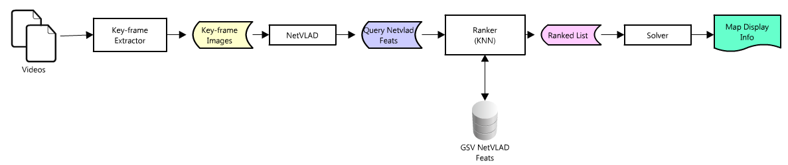

# Video Geolocator

This project aims to locate within a certain range where was a certain
video taken from or where are the points of interest located.


## Architecture



## Filenames

```
- Video:      <video_name>.mp4
- Key-frame:  <video_name>_<kf_num>.jpg
- Feature:    <video_name>_<kf_num>.nvlad
- Rank:       <video_name>_<kf_num>.rank

```

## Data organization

```
Dataset
 +- Images
 +- Netvlad
 `- LocList.txt

Pipleine
 +- Videos
 |  `- LocList.txt
 +- Keyframes
 +- NetVLAD
 |  +- <video>
 |  +- ...
 +- Ranking
 `- Viz
```
